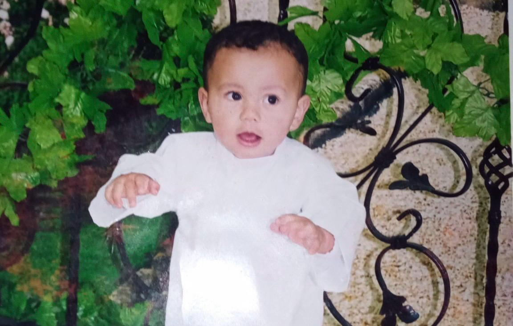

<h1 align="center">Mohamed El Gorrim</h1>
<h3 align="center">Software &amp; Intelligent Systems Engineer — ML/MLOps, Distributed AI</h3>

  

<em>
Most of my work on AI relies on understanding data — closing the gap between a notebook that works once 
and a model that survives real-world data. But I always find myself questioning why it can't generalize at real-world scale, 
why a model behaves like a bad human and cheats its way to a good train result. 
And in the end, I concluded: the human mind will always stay a wonder, no matter what AI reaches.
</em>

  
  &nbsp;
  
  &nbsp;
  

---

## Experiences

**AI Research Intern @ UM6P** — Geology and Sustainable Mining Institute, Ben Guerir. Rebuilt a geosite-discovery pipeline after finding target leakage in the original: 939 expert-sourced labels, 500m-clustered CV, McNemar-tested across four tree models — 74.9%/71.7% binary accuracy, presence-background model at 0.956 AUC. Also modeling Cr(VI) adsorption on iron-grafted biochars with study-grouped/leave-one-study-out validation (Random Forest, R² = 0.893, externally validated).

**AI/ML Engineering Intern @ FaceJob** (remote) — Built the AI pipeline for a video-CV recruitment platform from scratch: FastAPI, Whisper transcription, LLM-based coaching/pitch generation on AWS ECS/RDS/IAM, with injection-resistant prompts and content-validation gates against prompt injection.

---

## Featured Projects

<table>
  <tr>
    <td width="50%" valign="top">
      <h3><a href="https://github.com/MedGm/Ollie">Ollie</a></h3>
      
Fast, Linux-native desktop GUI for Ollama — Tauri 2 (Rust) + React/TypeScript.

      <ul>
        <li><strong>50 stars, 7 forks</strong> — real adoption, not a portfolio piece</li>
        <li>Local-first chat UI, model management, vision/file analysis, live resource monitoring</li>
      </ul>
      
      
      
    </td>
    <td width="50%" valign="top">
      <h3><a href="https://github.com/MedGm/Real-time-Product-Recommender">Real-Time Product Recommender</a></h3>
      
Lambda-architecture streaming pipeline: Kafka + Spark (batch &amp; streaming) + Airflow.

      <ul>
        <li>568k reviews ingested, auto-retrained via Airflow</li>
        <li>Bias-decomposed ALS: <strong>RMSE 1.55 → 0.497</strong>, served to 11,751 users at &lt;5ms p50 via FastAPI</li>
      </ul>
      
      
      
    </td>
  </tr>
  <tr>
    <td width="50%" valign="top">
      <h3><a href="https://github.com/MedGm/PRISM">PRISM</a></h3>
      
Product Ranking Intelligence &amp; Signal Mining — e-commerce intelligence platform, zero to insight.

      <ul>
        <li>1,757 products scraped from 8 stores into 9 typed Kubeflow Pipelines components</li>
        <li>Great Expectations DQ gate, RF+XGBoost scoring, KMeans/DBSCAN clustering, Apriori rules</li>
        <li>Served via FastAPI with live Gemini LLM chat over a DuckDB warehouse</li>
      </ul>
      
      
      
    </td>
    <td width="50%" valign="top">
      <h3><a href="https://github.com/MedGm/MoroccanLLM">MoroccoTone</a></h3>
      
Darija LLM fine-tuning — QLoRA post-training of Qwen2.5-7B for dialectal NLP and code-switching.

      <ul>
        <li>Curated 55,140 Darija-French code-switching examples</li>
        <li>4-bit QLoRA via Unsloth: val loss <strong>0.804 → 0.590</strong></li>
        <li>Adapter + dataset published on Hugging Face</li>
      </ul>
      
      
      
    </td>
  </tr>
</table>

Also: <a href="https://github.com/MedGm/Oracle-AI-Platform">Oracle AI Platform</a> — RAG-assisted Oracle DBA copilot (ChromaDB + SentenceTransformers, grounded LLM for security scoring and log-based anomaly detection)

---

## Research &amp; Competitions

| | |
|---|---|
| **Publication** | [FSC-Net: Fast-Slow Consolidation Networks for Continual Learning](https://arxiv.org/abs/2511.11707) (arXiv:2511.11707) — dual-network architecture mitigating catastrophic forgetting, +8.20pp retention gain on Split-CIFAR-10 |
| **Competitions** | Moroccan Collegiate Programming Contest (MCPC 2025), CODE IT V8 (EHTP), [NVIDIA Nemotron Reasoning Challenge](https://www.kaggle.com/code/elgorrimmohamed/nvidia-nemotron-model-reasoning-challenge) (Kaggle, LoRA reasoning, score 0.656), [Kaggriculture](https://github.com/MedGm/kaggriculture-agent) (Kaggle farming-sim capstone — rule-based crop agent, beats baseline ~$13.5k vs ~$3.5k) |
| **Certifications** | Oracle Cloud Gen AI Professional, OCI AI Foundations Associate |

---

## Stack

  

  

  

  

  

---

  

<picture>
  <source media="(prefers-color-scheme: dark)" srcset="https://raw.githubusercontent.com/MedGm/MedGm/output/pacman-contribution-graph-dark.svg">
  <source media="(prefers-color-scheme: light)" srcset="https://raw.githubusercontent.com/MedGm/MedGm/output/pacman-contribution-graph.svg">
  
</picture>

---

  <a href="https://github.com/MedGm">GitHub</a> ·
  <a href="https://www.linkedin.com/in/mohamed-el-gorrim/">LinkedIn</a> ·
  <a href="https://medgmportfolio.vercel.app/">Portfolio</a> ·
  <a href="mailto:elgorrim.mohamed@etu.uae.ac.ma">Email</a>

